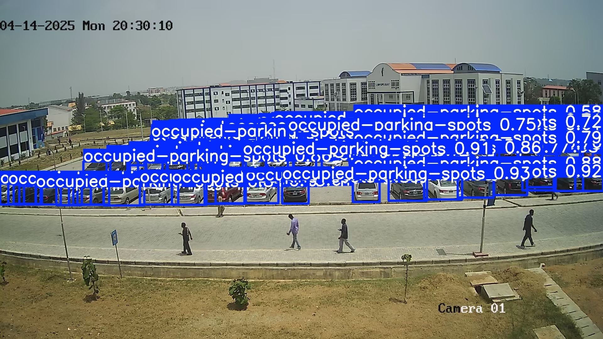

# Graduate Engineer
#### Technical Skills: Python (Machine learning & Computer Vision), Microsoft Excel, SQL, PowerBI, Power Automate, Microsoft Azure (Agentic AI Development), Process Mapping 

### Education
B.Eng., Electrical & Electronics Engineering | Nile University of Nigeria (2020-2025)

### Work Experience
Business Systems Analyst Intern @ Simpletin Consulting (May 2025 - Oct. 2025)
- Primarily worked on requirement gathering and process mapping for internal and external projects.
  - Conducted Markert research and data gathering for a school choice reccommendation system
  - Built a Site Map for the company's intranet platform
  - Built a process map for a lead generatiion system enabling targeting marketing campaigns to 50 + prospective clients

RF Engineer/Network Analyst Intern @ Huawei Technologies (Mar. 2024 - Aug. 2024)
- 3G, 4G LTE, and 5G Network Analysis
- Created charts and dashboards for Network Performance evaluation and optimization actions using Excel and Huawei Cloud (U2020)
- IP Transmission data tracking for 3G IPPM/IUB drops and 4G Packet loss

AI/Machine Learning Intern @ National Centre for Artificial Intelligence and Robotics (Aug. 2025 - Oct. 2025)
- End to end machine learning development using python and frameworks such as: Pandas, Numpy, Matplotlib, and SckitLearn
  
## My Projects
## Smart Parking Lot Management System with Object Detection and Web-Interface

A smart parking lot management system built as a web app. It uses camera-based object detection to periodically count the number of cars in an unmarked parking lot and subtracts this from the total capacity to estimate available spaces. The web app displays the number of free slots in a clean and simple interface, giving drivers real-time visibility into parking availability.  

.jpeg)

### 4G LTE KPI Dashboard  

An interactive Excel dashboard designed to track key 4G LTE network KPIs across multiple regions. It visualizes performance trends, highlights degradations, and supports quick comparison of regional metrics for better network optimization and decision-making.

